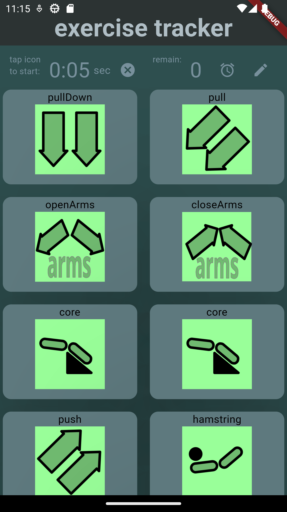
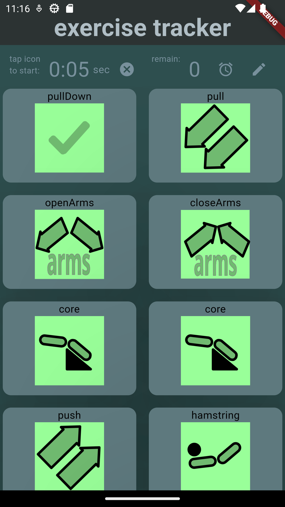
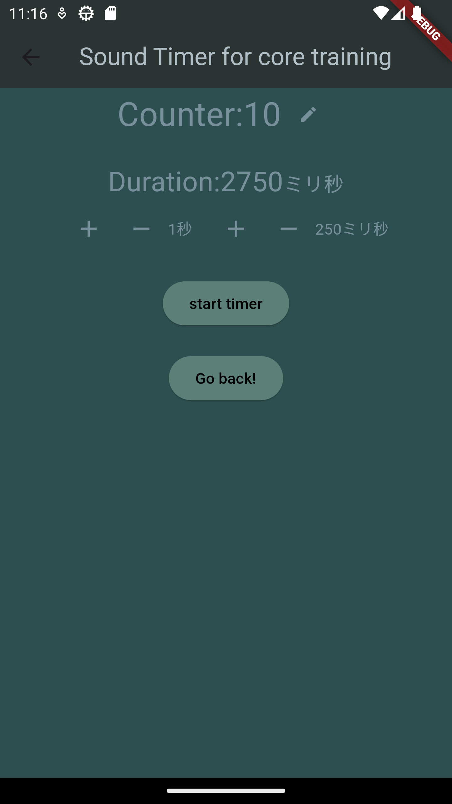

# exercise_tracker

Flutter application フラッターアプリケーション

Exercise Tracker エクササイズトラッカー

- ジムでのエクササイズの実行を管理
- 各エクササイズの時間を管理
  - 2 種類のタイマー

## ２種類のタイマーを提供

1. 単純なタイマー
   ある時間(例えば 5 分間)続けるエクササイズ用
   - 画面に残り時間が表示される
   - 開始と終了時ビープ音
2. メトロノーム
   一定間隔で決められた回数繰り返すエクササイズ用
   - 一定間隔でビープ音

## todos

- 単純なタイマー利用時、タイマー開始前に 10 秒の余裕を持たせる
  (スマホ操作してスマホを置いてそれから器具に位置する)
- メトロノーム利用時、開始前に 10 秒の余裕を持たせる
- メトロノームのキャンセル処理追加

## done

- メトロノーム終了時のアイコン変更
- 単純なタイマーの値を変更できるようにする
- メトロノームの回数、間隔を開始前に変更できるようにする
